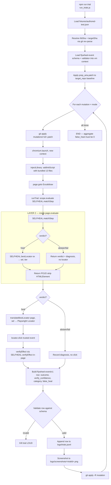
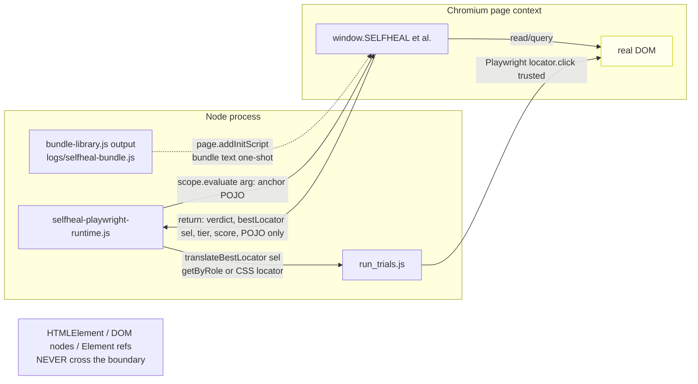

# Architecture Stack + Functional Block Diagram — as-is (2026-09-21)

**Scope.** How the three moving pieces — the Node harness (this repo), the injected browser library (ai-for-qa @ `599dca1c`), and the target SPA (Excalidraw @ `e1bb9ff8`) — actually fit together and run one trial today. This is a description of what exists, not a proposal.

**Companion doc.** `architecture.md` on branch `claude/code-wiki-repo-setup-8dbc46` documents the design-doc's *planned* 8-stage self-heal loop (with a stage→file→status table where every row says "planned"). This doc covers what is *actually running* end-to-end today, which is a specific slice of that loop.

## Evidence table (every claim below is backed by a file:line grep this session)

| Claim | Evidence |
|---|---|
| Library is browser-only, IIFE-globals, no build step | `selfheal-core.js` header: "No build step; runs in any JS context with DOMParser"; every schema/pipeline file wraps in `(function(root){…})(typeof window!=='undefined'?window:globalThis)` (grepped 3 schemas + core) |
| Harness bundles exactly 13 files in a fixed order | `harness/bundle-library.js`, the `files` array (lines 17-31) |
| Bundler scrubs 6 vendor names from source comments | `harness/bundle-library.js`, `VENDOR_NAMES = ['testsigma','gong','amplitude','appsmith','immich','salesforce']` (line ~45) |
| Node ↔ browser only exchange POJOs | `harness/selfheal-playwright-runtime.js` line 32: "Strip HTMLElement — never crosses the boundary" |
| Injection happens via `addInitScript` before page loads | `harness/selfheal-playwright-runtime.js` `injectLibrary()`, lines 22-28 |
| Match runs in-page via `scope.evaluate` | `harness/selfheal-playwright-runtime.js` `matchInScope()`, lines 34-49 |
| bestLocator is derived *outside* matchStep, from the returned `ex` | same file line 40: "bestLocator is a SEPARATE derivation via SELFHEAL.bestLocator(ex), not a field on `best`" |
| Runner does 7 mutations × 2 event modes with retry-3x | `harness/run_trials.js` `MUTATIONS[]`, `MODES[]`, header comment |
| Every row schema-validated before write to JSONL | `harness/run_trials.js` lines 27-38 (vm context load) + validation-kills-trial policy in header |
| The false-heal gate is a single-source decision, identity-based | `self-heal/schemas/false-heal.js` header comment; `isFalseHeal()` function body |
| Locator translator throws on unknown formats (fail-loud) | `harness/translate-locator.js` lines 3-4: "silent fallback would hide adapter bugs and let a wrong-element click reach the trusted-events path" |
| The pinned lib SHA carries a preflight7-fork-only feature | `git merge-base --is-ancestor 599dca1c a31ace4` → exit 1; `git log -1 599dca1c` → author `preflight7`, subject "per-key heal policy" |

## Stack diagram — three layers, two boundaries

```
┌─ LAYER 1: NODE HARNESS (this repo — experiment-only / feature/three-gaps) ──┐
│                                                                              │
│  Runtime: Node ≥ 18, ES modules, `"type":"module"` in package.json           │
│  Dep:     playwright ^1.47.0 (only npm dep)                                  │
│                                                                              │
│  Entry:   npm run trial → node harness/run_trials.js                         │
│  Support: harness/bundle-library.js, translate-locator.js,                   │
│           selfheal-playwright-runtime.js                                     │
│                                                                              │
│  Reads:   fixtures/authored-test.json         (recorded step + descriptor)   │
│           mutations/*.patch                    (drift induction)             │
│           lib/  (submodule @599dca1c)          (13 files, bundled)           │
│           target_repo/ (Excalidraw @e1bb9ff8) (patched per trial)            │
│                                                                              │
│  Writes:  logs/selfheal-bundle.js              (build artifact)              │
│           logs/trials.jsonl                    (one flywheel-event/v1 / row) │
│           logs/screenshots/<trialId>.png       (per-trial screenshot)        │
│                                                                              │
└─────── BOUNDARY 1 ──── page.addInitScript(bundle text)  ── one-way, one-shot ┘
        │
        │ (bundle string is UTF-8 JS source; executes in browser context BEFORE
        │  first navigation. IIFEs install SELFHEAL_* globals on `window`.)
        ▼
┌─ LAYER 2: INJECTED BROWSER LIBRARY (ai-for-qa @599dca1c, 13 files) ─────────┐
│                                                                              │
│  Runtime: Chromium (headed for trusted events)                              │
│  Deps:    DOMParser (browser built-in) — nothing else                       │
│                                                                              │
│  Globals installed (load order matters — bundle-library.js line 17-31):    │
│    window.SELFHEAL                  ← selfheal-core.js                      │
│    window.SELFHEAL_FALSEHEAL        ← schemas/false-heal.js                 │
│    window.SELFHEAL_SCHEMA_FLYWHEEL  ← schemas/flywheel-event.schema.js      │
│    window.SELFHEAL_CANDGEN          ← pipeline/candidate-generation.js      │
│    window.SELFHEAL_DIAGNOSIS        ← pipeline/change-diagnosis.js          │
│    window.SELFHEAL_VALIDATE         ← pipeline/candidate-validation.js      │
│    window.SELFHEAL_REPORTER         ← pipeline/failure-reporter.js          │
│    window.SELFHEAL_VERIFY           ← pipeline/outcome-verification.js      │
│    window.SELFHEAL_TEMPORALWAIT     ← pipeline/temporal-wait.js             │
│    window.SELFHEAL_SEARCHPICK       ← pipeline/search-and-pick.js           │
│    window.SELFHEAL_LEARN            ← pipeline/learning-loop.js             │
│    window.SELFHEAL_BRAIN            ← brain/brain.js                        │
│    window.__RUNTIME                 ← pretotype/selfheal-runtime.js         │
│                                                                              │
│  Public API used by harness:                                                │
│    SELFHEAL.matchStep(doc, anchor, {gate}) → {verdict, best, margin, ...}   │
│    SELFHEAL.bestLocator(ex) → {sel, tier}                                   │
│    (harness never touches CANDGEN/DIAGNOSIS/BRAIN directly — they run       │
│     inside matchStep's own pipeline)                                        │
│                                                                              │
└─────── BOUNDARY 2 ── scope.evaluate(() => …) ── returns POJO only ──────────┘
        │
        │ (browser reads real DOM; returns {verdict, bestLocator, tier, score,
        │  margin, via, diagnosis} — HTMLElement is stripped, never crosses.)
        ▼
┌─ LAYER 3: TARGET SPA (Excalidraw @e1bb9ff8, mutated per trial) ─────────────┐
│                                                                              │
│  Runtime: Vite dev server on :3001                                          │
│  State:   pristine + prep_aria.patch always applied; one mutation patch     │
│           per trial (git apply before, git apply -R after)                  │
│                                                                              │
│  Mutations exercised (run_trials.js MUTATIONS[]):                           │
│    pristine, A1 (restyle), A2 (icon wrap), A3 (outer wrapper),              │
│    B1 (restyle), B2 (duplicate injected → expect ABSTAIN),                  │
│    B3 (route-form: no patch, page.route 500ms delay),                       │
│    never_heal_A1 (Gap I: policy short-circuit test → expect ABSTAIN/POLICY) │
│                                                                              │
└──────────────────────────────────────────────────────────────────────────────┘
```

## Functional block diagram — one trial, end to end



## Boundary contract diagram — what crosses, what doesn't



**Rule (source: `selfheal-playwright-runtime.js:32`):** Element refs never cross Boundary 2. The browser resolves the target and returns a *serializable selector*; the Node side re-resolves that selector via Playwright's Locator API and fires the trusted click. This is why `translate-locator.js` exists — the library speaks a selector dialect (`role=button[name="Menu"]`) that Playwright's plain `page.locator()` doesn't accept, and the translator throws (does not silently fall back) on any unrecognized shape.

## Where the gate lives

```
                    ┌───────────────────────────────────┐
                    │  self-heal/schemas/false-heal.js  │  ← single-source
                    │  isFalseHeal({verdict,             │     decision
                    │               expectedVerdict,     │     (identity-based,
                    │               resolvedIdentity,    │      NOT confidence)
                    │               expectedIdentity})   │
                    └──────────┬────────────────────────┘
                               │
                ┌──────────────┴──────────────┐
                │                             │
                ▼                             ▼
    ┌────────────────────┐        ┌───────────────────────┐
    │  S4 benchmark      │        │  S8 live executor     │
    │  classifier        │        │  (this harness)       │
    │  (offline eval)    │        │  writes flywheel row  │
    └────────────────────┘        └───────────────────────┘
                                             │
                                             ▼
                                 logs/trials.jsonl
                                             │
                                             ▼
                                 report/*.md: sum(false_heal) == 0
```

## Load-order dependency graph (why the 13-file order in bundle-library.js matters)

```
selfheal-core.js  (installs SELFHEAL)
    │
    ├─→ false-heal.js  (installs SELFHEAL_FALSEHEAL — depends on nothing but sets identity for schema)
    │
    ├─→ flywheel-event.schema.js  (installs SELFHEAL_SCHEMA_FLYWHEEL — schema of what the row is)
    │
    ├─→ pipeline/*.js  (each installs SELFHEAL_<STAGE>; several read SELFHEAL for scoreEx, verdict etc.)
    │       candidate-generation → change-diagnosis → candidate-validation →
    │       failure-reporter → outcome-verification → temporal-wait →
    │       search-and-pick → learning-loop
    │
    ├─→ brain/brain.js  (installs SELFHEAL_BRAIN — depends on SELFHEAL for isRealAnchor selector check)
    │
    └─→ pretotype/selfheal-runtime.js  (installs __RUNTIME — depends on ALL prior globals)
```

**Load-order failure mode.** If a bundler re-order (deliberate or bug) puts brain.js before selfheal-core.js, `SELFHEAL_BRAIN`'s put() gate cannot resolve `SELFHEAL.isRealAnchor`, and the cache silently accepts non-anchor selectors — invalidating the "cache verify-gated" property. There's no assertion at bundle time that would catch this; the failure surfaces only when a role+name locator gets cached and later fails to re-resolve. Recorded here explicitly because the merge plan proposes vendoring these files, and the vendored copy has to preserve the order.

## What is *out* of the currently-running loop (from the design doc's 8-stage plan)

The design doc's stage→file→status table (on `claude/code-wiki-repo-setup-8dbc46:wiki/architecture.md`) has 10 rows all marked "planned." The current runtime exercises stages 5–7 (EXECUTE / DIAGNOSE / HEAL) and the VERIFY cross-cut, on a *pre-authored* fixture. Explicitly NOT running today:

- **STUDY (`tools/app-observer.js`)** — the app-walker that enumerates controls; not called by the harness.
- **INTENT (Clue-3)** — the "one-line why" that survives redesign; not in the fixture format.
- **LEARN (`pipeline/learning-loop.js`)** — the global installed by the bundle, but the harness makes no call into it.
- **STUDY / RECORD** — the fixture is hand-authored, not recorded by the library.
- **HITL overlay** — panel/UI code is in ai-for-qa, not injected here.

This matters for the merge plan: **vendoring the 13 bundled files does not vendor stages STUDY, RECORD, INTENT, HITL, LEARN.** Any future work that needs those stages will re-open the "what to pull from ai-for-qa" question — the current plan resolves *this* harness's needs, not the full 8-stage vision.

## Cynical review (internal redteam pass — before advancing to Step 2)

1. **"The bundle is browser-only" is a claim, not a guarantee.** `run_trials.js` (lines 22-38) loads `lib/self-heal/schemas/validator.js` and `lib/self-heal/schemas/flywheel-event.schema.js` into a **Node `vm` context** for row validation — so those two schema files must run in *both* Node (via vm) and Browser (via IIFE globals). Any refactor that adds a browser-only API (e.g. `window.crypto.subtle`) to those files breaks the vm-context load without breaking the browser path — the harness kills the trial "with a loud diagnosis," but the load-time failure is a separate error class than the runtime one. Worth noting in the vendoring plan as a constraint on which files stay in dual-mode.
2. **The diagram shows one trial. The runner does 14 (7 mutations × 2 modes) with retry-3x = up to 42 trial attempts, mutation-agnostic revert on failure.** The block diagram is truthful for a single trial; readers may under-estimate the state-machine complexity. `run_trials.js`'s `applyPatch`/`revertPatch`/`repoStatusPorcelain`/`repoDiffMatchesPrepOnly` (grep in the file) exists specifically to detect partial-revert state after an aborted trial. The merge plan does not currently address `target_repo` — which is *not* a git submodule but is git-tree-manipulated by the runner. That's a lurking dependency.
3. **`translate-locator.js` throws on unknown formats — but the library's format zoo is inferred, not versioned.** The file comment says "Format zoo (from selfheal-core.js + brain.js.isRealAnchor + code inspection)" — the harness doesn't consume a machine-readable format spec; it consumes what code inspection surfaced at time-of-write. Any new format the library emits will crash the harness with a clear message, but no schema-version bump warns the reader. Trade-off: fail-loud vs. silent-drift; this repo has chosen fail-loud, which is correct for a false-heal-gated system, but the merge plan should preserve that stance and not "helpfully" add a silent fallback for backward compatibility.
4. **The load-order failure mode is real but under-instrumented.** No test asserts that `SELFHEAL_BRAIN` correctly resolves `SELFHEAL.isRealAnchor` at bundle-time. If the vendored copy accidentally re-orders the file list, the failure is silent until a role+name locator happens to be cached. Suggested improvement (defer to Step 5's plan, but flag here): a smoke test that after bundling, `typeof window.SELFHEAL.isRealAnchor === 'function'` before any brain.put() call — a 5-line test that closes a real half-bridge.
5. **This diagram is *not* the 8-stage design doc's diagram.** The 8-stage loop is aspirational; this loop is a P2 slice that exercises ~40% of it. If the wiki reader sees two architecture docs both titled with the word "architecture," they will conflate the two. Fix: rename this file to `execution-flow.md` when it lands on the canonical branch, and cross-link from `architecture.md` (the design doc). Or accept that the design doc is stale and this doc replaces it. Not this step's decision — flagged for Step 2's HLD.

## Assumptions this doc makes explicit (validate before Step 2)

- **A1.** The reader wants "as-is" (what runs today), not "to-be" (what the design doc promises). Step 2's HLD covers the to-be.
- **A2.** The pinned lib SHA `599dca1c` — with the preflight7-fork-only per-key heal policy — is treated as the correct current state, since that's what the harness's own trial reports were measured against. If the user later decides to re-baseline against `prashantkothari/ai-for-qa` main, this doc becomes wrong at Layer 2 (the `SELFHEAL_BRAIN` globals would lack the policy field).
- **A3.** The target SPA choice (Excalidraw @e1bb9ff8) is representative for now, not permanent. The architecture makes no claim that Excalidraw is the only or the best target — mutations were chosen against its DOM, but the runtime is target-agnostic (it drives whatever's on :3001).
- **A4.** `logs/trials.jsonl` and `logs/screenshots/` are the *only* runtime outputs. No metrics endpoint, no dashboards wired to real data — the design-doc's `qi-dashboard.html` and `panel/panel.html` (in ai-for-qa root) render *fixtures*, not this harness's output. Merge plan should decide whether that stays true.

## Open questions for the user (before proceeding to Step 2)

- **Q1.** Should this doc replace the "planned" architecture doc on `claude/code-wiki-repo-setup-8dbc46:wiki/architecture.md`, or sit alongside it as `wiki/execution-flow.md`? (Cynical review #5.)
- **Q2.** Is `target_repo/` (Excalidraw) considered part of the repo we're consolidating, or an external checkout the harness expects to find? The current merge plan doesn't mention it; the runner treats it as a required sibling directory. (Cynical review #2.)
- **Q3.** Are the four un-exercised stages (STUDY, RECORD, INTENT, LEARN, HITL) in scope for eventual merge, or are we consolidating only the currently-consumed 13 files and leaving the rest of ai-for-qa alone? (Bottom-of-doc "What is out" section.)
