# ARCHITECTURE.md — the autonomous self-heal loop + OSS pattern map

Tech-architecture reference for the self-heal system. Two parts: **(1)** the ideal end-to-end loop
(study → locate → record → intent → execute → diagnose → heal → learn), **(2)** which OSS tools/patterns
to borrow for each stage. Design stance (§4): **borrow patterns/gists, adopt tools only where
reimplementing is wasteful** — aim a *basic good flow at ~80%*, route the hard 20% to LLM/HITL.

---

## In plain words (read this first)

A test clicks a button. One day the button moves, gets renamed, or disappears, and the click fails.
This system figures out **why** it failed and decides what to do:

- The button just **moved or got renamed** → quietly re-point the locator and keep going.
- The button is **genuinely gone**, or the **app flow changed** → stop and tell the human exactly what's
  wrong. Don't guess.

**The golden rule: never click the WRONG thing to make a test pass.** A clear, honest failure beats a wrong
fix every time. Everything below is *how* we do that safely. (Jargon like Q1/Q2/Q3, T0–T3, K-numbers is just
shorthand — each is explained where it's used.)

## 1. The ideal autonomous loop

```mermaid
flowchart LR
  STUDY["1 · STUDY<br/>autonomously explore flows<br/>(enumerate controls)"] --> LOCATE
  LOCATE["2 · LOCATE<br/>candidates + 11-signal descriptor"] --> RECORD
  RECORD["3 · RECORD<br/>captureStep + captureContext + flag"] --> INTENT
  INTENT["4 · INTENT<br/>author/AI one-line 'why'"] --> EXECUTE
  EXECUTE["5 · EXECUTE<br/>act via driver · search-and-pick"] --> DIAGNOSE
  DIAGNOSE["6 · DIAGNOSE<br/>why it failed (7-category)"] --> HEAL
  HEAL["7 · HEAL<br/>context / ordinal / widener + gate"] --> VERIFY
  VERIFY["verify-by-effect<br/>(3-way outcome)"] --> LEARN
  LEARN["8 · LEARN<br/>verified outcomes · cross-tenant"] -.feeds.-> STUDY
  RECORD -. "weak / ambiguous flag" .-> HITL{{"HITL popup"}}
  HEAL -. "abstain · 1st-heal · unverified" .-> HITL
  DIAGNOSE -. "residue: nameless / flow-change / visual" .-> LLM[["LLM / vision gate"]]
  HITL -. "author decision = ground truth" .-> LEARN
  LLM -. "caption / pick" .-> HEAL
```

### Stage → our component → status → OSS pattern borrowed

| # | Stage | What it does | Our component (file) | Status | OSS pattern (borrow) |
|---|---|---|---|---|---|
| 1 | **STUDY** | autonomously walk the app, enumerate every visible+revealed control | `tools/app-observer.js` | ✅ built | **Swarm (useswarm.co) / Propolis** — AI-persona flow-exploration (pattern, not dep) |
| 2 | **LOCATE** | extract 11 signals, score candidates, rank | `selfheal-core.js` (`WEB.extract`, `scoreEx`, `rank`) | ✅ proven | **Momentic** intent + multi-layer fallback (pattern); **axe-core** a11y-signal logic (gist) |
| 3 | **RECORD** | write a recorded step: descriptor + container context + fragility flag | `captureStep`, `captureContext` | ✅ built | **OpenTest** declarative YAML keyword step format (gist); **Momentic `explore`** auto-gen cases (pattern) |
| 4 | **INTENT** | capture author's one-line "why" (survives full redesign) | — (Clue-3, deferred) | ◻ P2/P3 | **Momentic** intent-based; **Vision-LLM** caption for nameless icons |
| 5 | **EXECUTE** | perform the action; for role-less menus → search-and-pick | `selfheal-runtime.js` (P2); search-and-pick (K33) | ◻ P2 (needs runtime) | **Playwright** — ADOPT wholesale (auto-wait + locators); Selenium/Appium baseline (OpenTest) |
| 6 | **DIAGNOSE** | name *why* a step failed: DRIFT/REMOVAL/AMBIGUITY/STATE/TEMPORAL/FLOW_CHANGE/UNKNOWN | `change-diagnosis.js`, core `diagnose` | ✅ built | **Antithesis** fault-classification mindset (gist) |
| 7 | **HEAL** | break ties deterministically: row-text → ordinal → widener; gate; else abstain | `candidate-generation.js` (`disambiguateByContext` etc.) | ✅ proven (K19/K26/K34) | **Momentic** confidence-logged heal-suggestion (→ our HITL) |
| — | **VERIFY** | confirm the declared effect happened (3-way: pass / fail / unverified→human) | `outcome-verification.js`, core `verifyEffect` | ◑ modelled (live = P2) | **Antithesis** reproducible replay (gist) |
| 8 | **LEARN** | only from HIGH-confidence verified outcomes; cross-tenant aggregation | `learning-loop.js` (P2/P3 stub) | ◻ P2/P3 | **Momentic** feedback loop; cross-tenant moat (I27) |
| ⟂ | **HITL** | record-time anchor-strengthening + execute-time adjudication | `tools/hitl-overlay.js` (v2) | ◻ building | the heal-rate unlock (K35) |
| ⟂ | **LLM/vision gate** | the deterministic residue: nameless icons, flow-change, full visual redesign | — | ◻ P3 | hosted Vision-LLM (adopt API, don't train) |

---

## 2. OSS / competitor map — what each is good for

| Tool | What it is | Borrow for | Borrow GIST or ADOPT TOOL? |
|---|---|---|---|
| **Momentic** ([self-heal guide](https://momentic.ai/blog/self-healing-test-automation-guide)) | AI low-code E2E; intent locating, multi-layer fallback, ML self-heal w/ confidence + suggest-fix, `explore` auto-test-gen | LOCATE, RECORD (auto-gen), HEAL (suggest=HITL) | **gist** — we stay deterministic/explainable, not ML-black-box |
| **Antithesis** ([antithesis.com](https://antithesis.com/)) | deterministic simulation, property-based testing, fault-injection, reproducible replay | EXECUTE/LEARN — property-based drift fuzzing; determinism as core value | **gist** — they do backend/system chaos; we do UI resilience (complementary) |
| **OpenTest** ([getopentest.org](https://getopentest.org/)) | OSS keyword-driven (YAML) on Selenium/Appium; embed JS | RECORD — readable declarative step format; EXECUTE baseline | **gist** (format) + the Selenium/Appium driver if not Playwright |
| **Swarm** ([useswarm.co](https://www.useswarm.co/)) | AI-**persona** UX testing — runs personas through your product, surfaces friction/drop-offs + actionable code-fixes; browser/CLI/**MCP-server**, pushes to Jira/Linear/GitHub | STUDY (persona flow-exploration); HEAL output (actionable-fix = our HITL card) | **gist** — a UX *auditor* (distinct from our locator-resilience, cf. testers.ai K22); borrow the persona-explore + MCP-delivery + actionable-fix pattern |
| **Propolis** ([producthunt](https://www.producthunt.com/products/propolis)) | AI swarms that explore all product flows like real users, adapt to changes | STUDY — autonomous explore-all-flows | **gist** — = our Phase-A auto-test-gen |
| **Swarms.ai / OpenAI Swarm** ([github](https://github.com/openai/swarm)) | multi-agent orchestration frameworks | STUDY orchestration — fan-out explorer agents | **gist** — we already orchestrate via chips/workflows |
| **Playwright** | modern browser driver: auto-wait, locators, trace | EXECUTE runtime | **ADOPT wholesale** (P2) — reimplementing a driver is wasteful |
| **axe-core** | accessibility engine | LOCATE — accessible-name/role logic | **gist** (logic, ~50 LOC) not the dep |
| **Healenium** ([healenium.io](https://healenium.io/), [github](https://github.com/healenium/healenium)) | OSS self-healing locators (Selenium): weighted **LCS tree-compare** picks a new locator on `NoSuchElement`; **Postgres history DB** of old→new locators + DOM + screenshots | LOCATE (alt structural algorithm); the **self-evolving brain** (history store) | **gist** (LCS tree-compare) + the **history-DB-as-brain** pattern — but add our **verify-gate** (it stores on heal; we store only verified/HITL-confirmed) |
| **Skyvern** ([github](https://github.com/Skyvern-AI/skyvern), 22k★) | OSS vision+DOM+LLM browser agent; **Planner/Actor/Validator**; **route-memorization** → compiles a solved flow into a deterministic Playwright script | screen-based residue (INTENT/HEAL); **learn-once → cache-deterministic** | **adopt** for the visual residue (P3); **borrow route-memorization** (LLM solves once, deterministic after) |
| **OmniParser / browser-use** ([browser-use](https://github.com/browser-use/browser-use)) | screen→structured-elements; OSS DOM+vision agents | screen-based LOCATE for the residue | gist/adopt for the vision gate |
| **Vision-LLM** (Claude/GPT-V) | image→intent | INTENT, residue HEAL | **adopt hosted API** — don't train |

---

## 3. Recommended stack (the 80/20)

- **Build-local (deterministic, our value-add — keep as ~gists):** descriptor extraction, scoring/matching, diagnosis taxonomy, disambiguation (context/ordinal/widener), search-and-pick, HITL overlay, property-based drift fuzzing. *Why: these are small, must be deterministic + explainable + false-heal-0; generic libs would re-introduce bugs (e.g., the substring-fuzzy false-heal).* 
- **Adopt wholesale (where reimplementing is wasteful):** **Playwright** as the EXECUTE runtime (auto-wait, locators, trace) — the one big dep worth taking; **hosted Vision-LLM** for the INTENT + residue gate.
- **Borrow the format/pattern (no dep):** OpenTest's declarative YAML step format; Momentic's auto-test-gen-by-exploration; Antithesis's property-based + reproducible-replay discipline; Swarms/Propolis's fan-out explorer pattern.

**Target:** a basic good flow at **~80%** — deterministic heal on the structured/anchored majority, **0 false-heals**, and the hard 20% (nameless icons, flow-change, full visual redesign) **routed to LLM/HITL, never force-healed**. Matches the project ethos: *a true 66–80% beats a fabricated 95%.*

---

## 3b. Agentic layers (events/failures/locator-path · self-evolving brain · screen-learning)

| Layer | What it is | Status | OSS to learn from |
|---|---|---|---|
| **Concepts the agent reasons over** | EVENTS (click/type/select/swipe/nav/assert) · FAILURE MODES (7-cat, `FAILURE-TAXONOMY.md`) · LOCATOR-PATH/ANCHOR TIERS (testid>stable-id>id-fragment>name-only>anchorless) + 11 signals + container/ordinal disambiguators | ✅ built | **Healenium** weighted LCS tree-compare (alt locator-path algorithm) |
| **Self-evolving brain** | persist heal outcomes (recorded→healed + descriptor + context + verify-confidence); cross-tenant aggregation (I27) | ◻ stub (P2/P3) | **Healenium** Postgres locator-history+screenshots; **Skyvern** route-memorization (cache solved path as deterministic) |
| **Agentic learning via screens** | vision+LLM for the residue (nameless icons, full visual redesign); Planner/Actor/**Validator** + memorize-as-deterministic | ◻ P3 / residue escape | **Skyvern**, **OmniParser**, **browser-use** |

**Honest constraint (critical):** the brain updates **only on HIGH-confidence *verified* or *HITL-confirmed* heals — NOT every heal.** Storing unverified heals contaminates it (OV#4) and compounds wrong heals into "learned" patterns. Screen/vision learning is the **20% residue escape**, not the core: LLM proposes → deterministic gate + verify dispose → only the verified result is memorized (Skyvern-style → deterministic + cheap next time).

## 3c. Analyzer 2.0 alignment (production convergence — K36)

Our loop maps 1:1 onto Testsigma's production **Analyzer 2.0** NSE flow (enhances, does not diverge):

| Analyzer stage | Our component | Net-new to build |
|---|---|---|
| **Q1 same page?** (fingerprint: URL-template+title+a11y-hash+landmarks+auth; VLM tie-break) | — | **NEW: Q1 fingerprint module** (the Step-0 front gate) |
| still-loading → **Timeout** | — | **NEW: network-log signal** (in-flight count + oldest-pending age) — solves TEMPORAL |
| **Q2 element here?** | `matchStep` → `disambiguateByContext` (context/ordinal/search-and-pick) → `WEB.actionable` | reuse (we're the Q2 specialist) |
| **Q3 earlier drift?** → Flow-Change vs Prerequisite | — | **NEW: per-prior-step fingerprint walk** — splits the two (fixes R3) |
| **Tiers T0–T3** | our HITL routing | adopt the T0–T3 vocabulary |
| **Validation gate** | `WEB.actionable` (found≠usable) | strengthen to **identity + ACTIONABILITY** (answers their OQ-2) |
| **Commit + reinforce + `analyzer_root_cause`** | `failure-reporter` + (P2) Element Registry | adopt the **root_cause enum** + reinforce-only-on-verified |

**We contribute** what their doc lacks: explicit **false-heal=0 metric**, the **Q2 disambiguation engine**, **actionability-in-gate**, and SPA-reality calibration. **Watch:** keep VLM gated+cached (it's on the critical path of 42% of failures).

## 3d. Execution-time Lifecycle alignment (production locator pool — K37)

Heal at runtime is a **locator POOL with lifecycle**, not a single best. Architecture order:
**Analyzer Gateway (diagnose) → Lifecycle auto-heal (pool + page-state).**

- **Pool**: primary + working-auto-healed (DB) + ≤25 backups across 6 sources (S3), each with pass/fail/`consecutive_pass_count`/`was_primary`/quality/source. Ordered by **execution-history (passed→untested→failed) + quality tiebreak — NOT rank**.
- **Top-three-agree consensus gate** (find-only JS, no action): top 3 candidates must resolve to the same element before acting → a proven safety lever (consensus) *complementary* to our margin+actionability.
- **Page-state heal 7a/7b/7c** = Analyzer Q1 = our diagnosis (triangulated): 7a unchanged→precondition heal (no new locators); 7b partial→regenerate on new DOM; 7c complete→**visual re-anchor** (never blind-rebuild — legacy attribute-rebuild was deprecated at **~90% FP**).
- **Conservative learning**: `consecutive_pass≥3`→auto-promote; `was_primary` sticky bit **freezes flip-flopping locators**; healed locators persisted **only on validated success** (OV#4). This is the self-evolving brain done safely.
- **Validation-agent (UI/HITL) ≡ auto-heal-agent (autonomous)** — one capability, two intervention modes, tagged by source. Our `hitl-overlay` is the validation-agent.
- **Scope, sharpened**: deterministic matching = disambiguate/validate FOUND candidates; **never re-anchor a LOST element** (→ visual/agent).

## 4. Honest stance — "patterns/gists, not whole libraries"

**Agreed, with one split.** Most of this system's value is *deterministic, explainable matching + diagnosis*, which is exactly what you should NOT outsource to a heavy/opaque lib — borrow the **gist** (the algorithm), keep it small and ours. But two things are wasteful to reimplement and should be **adopted wholesale**: a **browser driver** (Playwright — auto-wait/locators/trace are years of work) and a **vision LLM** (hosted API). Everything else = patterns. This keeps the dependency surface tiny, the behavior deterministic/auditable, and the false-heal gate intact — while not wasting effort rebuilding a driver or a vision model. The 80% flow is reachable with the gists we already have + Playwright for execution + an LLM gate for the residue.
